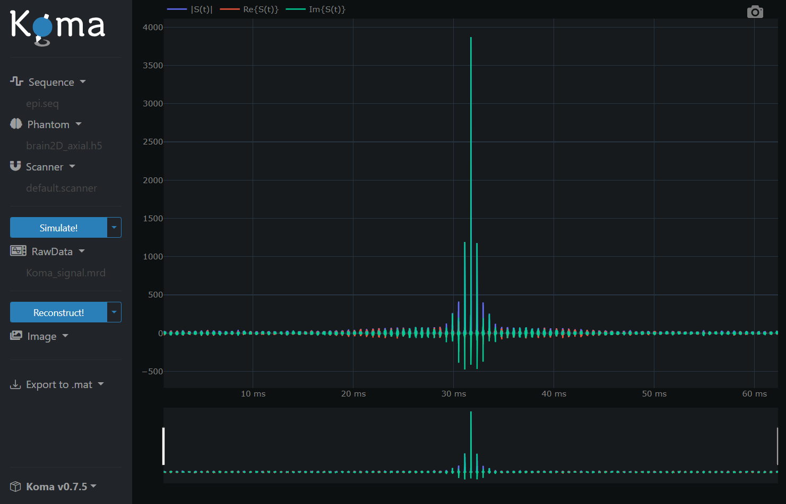

# Getting Started

It is mandatory to install Julia in your computer first. There are many tutorials out there to do so, we recommend to follow the official [Julia Getting Started](https://docs.julialang.org/en/v1/manual/getting-started/) documentation and the [Julia Downloads](https://julialang.org/downloads/) page to install the latest version of Julia in your machine. It is advisable you add julia to the PATH, which can be done during the installation process of Julia.

## Add KomaMRI

Once Julia is installed, open the Julia REPL and add the `KomaMRI` package to the default environment (note that in this example we installed Julia 1.7.3, so the default environment is `(@1.7)`). This process should take about 5min in a fresh Julia installation:
```julia-repl
julia> (press the "]" key)

(@v1.7) pkg> add KomaMRI

(@v1.7) pkg> (press the "backspace" key)

julia>
```

Then, launch the `KomaMRI` user interface (the first time you issue this command it may take more time than usual):
```julia-repl
julia> using KomaMRI

julia> KomaUI()
```

A window with the Koma user interface will pop up:


---
## UI Example

As a simple demonstration, press the button `Simulate!` and wait until the result is ready. Then click on the `Raw Data` dropdown and then click on the `View Raw Data` button. You should see the following result:



Then press the button `Reconstruct!` and wait until the reconstruction process is successful. Then click on the `Reconstruction` dropdown and then click on the `|Image|` button to see the image reconstruction example: 


